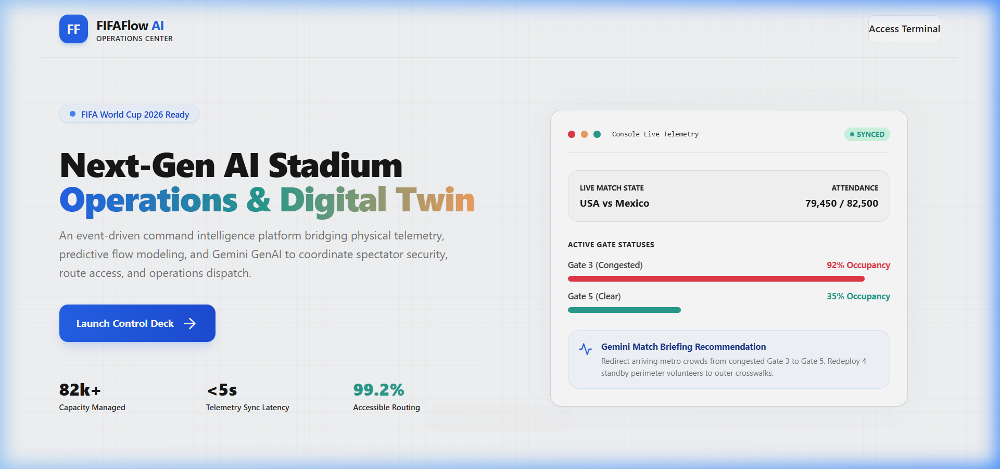
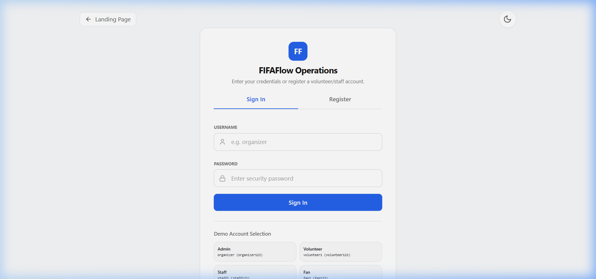
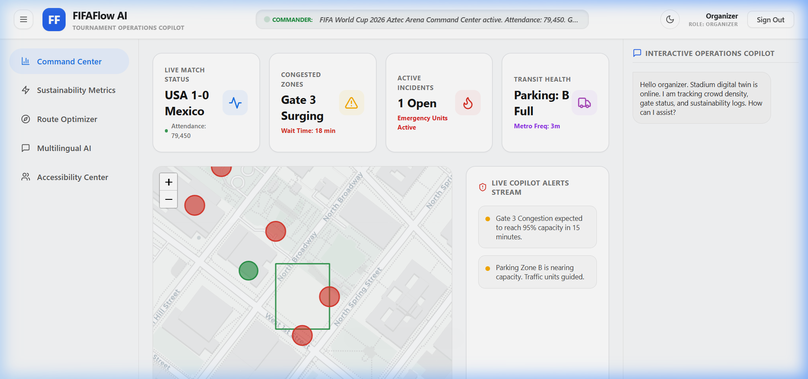

# FIFAFlow AI: AI Tournament Operations Platform & Digital Twin (FIFA 2026)

🚀 **Live Demo:** [https://fifa-flow-ai.vercel.app/](https://fifa-flow-ai.vercel.app/)

**FIFAFlow AI** is a comprehensive **GenAI-enabled solution** designed to enhance stadium operations and the overall tournament experience for fans, organizers, volunteers, and venue staff during the **FIFA World Cup 2026**. By leveraging **Generative AI** powered by Google Gemini, the platform fundamentally improves **navigation, crowd management, accessibility, transportation, sustainability, multilingual assistance, operational intelligence, and real-time decision support**.

---

## 1. Problem Statement & Why Current Systems Fail

### The Challenge
Hosting the FIFA World Cup 2026 involves coordinating tens of thousands of spectators, hundreds of security and medical professionals, volunteers, and transport hubs.

### Why Current Systems Fail
1. **Siloed Solutions**: Ticketing, navigation, transport, and emergency services operate on separate, disjointed platforms, preventing real-time cross-functional orchestration.
2. **Reactive Management**: Command centers act *after* a bottleneck or gate gridlock has already occurred, leading to long queues and security risks.
3. **No Explainable AI**: Standard chatbot tools act as generic Q&A agents without access to live venue parameters, offering no decision support to operators.

### Chosen Verticals & Alignment
To directly solve the hackathon problem statement, FIFAFlow AI explicitly targets the following required verticals:
- **Crowd Management & Operational Intelligence**: A Digital Twin State Manager that simulates gate gridlocks via the "What-If" engine.
- **Navigation & Accessibility**: A smart Pathfinder engine that explicitly routes fans away from bottlenecks and offers stair-free wheelchair accessible paths.
- **Real-Time Decision Support**: An Interactive Operations Copilot (Gemini) that provides instant triage and volunteer dispatch logic for incoming emergency incidents.
- **Multilingual Assistance**: A seamless voice translator for international fans to bypass language barriers.
- **Transportation Intelligence**: Real-time transit predictions including parking forecasts, shuttle schedules, metro delay tracking, and post-match exit rush analysis.
- **Sustainability Analytics**: Time-series energy, water, waste, and carbon footprint monitoring with AI-generated optimisation recommendations.

### Our Innovation: FIFAFlow AI
FIFAFlow AI introduces a live **Digital Twin State Manager** synchronized with a **Redis Event Engine** and **Gemini API**. It proactively predicts surges, simulates hypothetical scenarios via a "What-If" engine, suggests operational volunteer dispatches, and routes users around bottlenecks.

---

## 2. Platform Architecture & Data Pipeline

```
                     ┌────────────────────────────────────────┐
                     │       Sensors & Telemetry simulator    │
                     └───────────────────┬────────────────────┘
                                         │
                                         ▼
                     ┌────────────────────────────────────────┐
                     │          Digital Twin Registry         │
                     │    (PostgreSQL Database / Redis State)  │
                     └───────────────────┬────────────────────┘
                                         │  State Mutation Event
                                         ▼
                     ┌────────────────────────────────────────┐
                     │       Redis Pub/Sub Event Broker       │
                     └───────────────────┬────────────────────┘
                                         │
                                         ▼
                     ┌────────────────────────────────────────┐
                     │   Context Builder (Live RAG Assembly)  │
                     │  - Match info, Volunteers, Incidents   │
                     └───────────────────┬────────────────────┘
                                         │
                                         ▼
                     ┌────────────────────────────────────────┐
                     │         Gemini API AI Copilot          │
                     │ (Confidence Score & Decision Reasoning)│
                     └───────────────────┬────────────────────┘
                                         │
                                         ▼
                     ┌────────────────────────────────────────┐
                     │         WebSockets Broadcaster         │
                     └───────────────────┬────────────────────┘
                                         │
                                         ▼
                     ┌────────────────────────────────────────┐
                     │    Command Center UI & Live Map        │
                     └────────────────────────────────────────┘
```

---

## 3. Database Entity Relationship (ER) Diagram

* **User**: ID, Username, Email, Password Hash, Role (`organizer`, `volunteer`, `staff`, `fan`).
* **Stadium**: ID, Name, Location, Capacity, Layout Metadata.
* **Match**: ID, Teams, Start Time, Status (`scheduled`, `live`, `completed`), Current Attendance, Live Score, Weather.
* **DigitalTwinNode**: ID, Name, Type (`gate`, `restroom`, `medical_point`, `concession`, `transit_hub`), Location coordinates, Occupancy %, Status (`active`, `congested`, `closed`), Queue wait minutes.
* **Incident**: ID, Type, Severity (`Low`, `Medium`, `High`, `Critical`), Description, Status, Assigned Responder, AI Response Advice, Confidence Score, Reasoning.
* **Volunteer**: ID, User ID, Shift Timing, Active Status, Assigned zone layout coordinates.

---

## 4. Key AI Capabilities

1. **AI Match Commander**: Synthesizes stadium telemetry variables and publishes a live operational briefing ticker every 5 minutes.
2. **What-If Simulator**: Allows operators to simulate hypothetical variables (e.g. closing Gate 3) and returns wait time estimates, risk levels, and volunteer dispatches.
3. **Emergency Incident Advisory**: Classifies emergency details on submission, calculates responder routing, and recommends step-by-step procedures.
4. **Interactive Natural Language Queries**: Allows operators to query the state of the stadium (e.g. *"Summarize incidents from the last 30 minutes"*).
5. **Post-Match Operational Summaries**: Synthesizes match logs to formulate future queue optimizations, resource distributions, and energy-saving measures.

---

## 5. Technology Stack

* **Frontend**: React (Vite), TypeScript, Tailwind CSS, Recharts, Leaflet.js map layer, Framer Motion animations.
* **Backend**: FastAPI (Python), SQLAlchemy ORM, SQLite/PostgreSQL, Redis event streaming.
* **AI Model**: Google Gemini 1.5 Flash (via direct REST API endpoint structure).
* **Infrastructure**: Docker Compose (multi-container), Nginx reverse proxy, PostgreSQL 15, Redis 7.
* **Testing**: Pytest with pytest-asyncio, FastAPI TestClient.
* **Security**: JWT (Access + Refresh tokens), bcrypt password hashing, RBAC, CSP headers, rate limiting.

---

## 6. Monolithic Project Layout

```
36 FIFA FlowAI/
├── docker-compose.yml
├── README.md
├── CONTRIBUTING.md
├── LICENSE
├── pyproject.toml
├── .env.example
├── backend/
│   ├── Dockerfile
│   ├── requirements.txt
│   ├── main.py
│   ├── app/
│   │   ├── __init__.py
│   │   ├── core/ (config, db, security, event_engine, observability)
│   │   ├── models/ (SQLAlchemy models)
│   │   ├── schemas/ (Pydantic validation schemas with Literal types)
│   │   ├── services/ (gemini, pathfinder routing, simulator)
│   │   └── routes/ (auth, twin, incidents, copilot, transport, translate)
│   └── tests/ (auth, routing path tests)
├── frontend/
│   ├── Dockerfile
│   ├── nginx.conf
│   ├── package.json
│   ├── tailwind.config.js
│   └── src/
│       ├── App.tsx
│       ├── main.tsx
│       ├── index.css
│       ├── contexts/ (Theme & accessibility contexts)
│       └── components/ (CommandCenter, Leaflet twin map, access panels, translation tool)
└── tests/
    ├── conftest.py
    ├── test_api.py
    ├── test_auth.py
    ├── test_engine.py
    ├── test_security.py
    ├── test_routes_coverage.py
    └── test_websocket.py
```

---

## 7. Execution Guide & Deployment

### Quick Launch using Docker (Recommended)
1. Clone the project and copy the environment configuration:
   ```bash
   cp .env.example .env
   ```
2. Open the `.env` file and insert your API key:
   ```env
   GEMINI_API_KEY=AIzaSy...
   ```
3. Run the docker-compose orchestrator:
   ```bash
   docker-compose up --build
   ```
4. Access the web client at:
   `http://localhost` (serving Nginx proxy map).

### Manual Setup (Running Locally)

#### 1. Backend Server
1. Create and source a python environment:
   ```bash
   cd backend
   python -m venv venv
   source venv/bin/activate  # Or Windows: venv\Scripts\activate
   ```
2. Install packages:
   ```bash
   pip install -r requirements.txt
   ```
3. Boot the FastAPI engine:
   ```bash
   uvicorn main:app --reload --port 8000
   ```

#### 2. Frontend React Client
1. Enter folder and install dependencies:
   ```bash
   cd ../frontend
   npm install
   ```
2. Launch Vite local dev compiler:
   ```bash
   npm run dev
   ```
3. Open browser at:
   `http://localhost:5173` (proxies `/api` calls to port `8000` automatically).

### API Documentation
FastAPI automatically generates interactive API documentation:
- **Swagger UI**: `http://localhost:8000/docs`
- **ReDoc**: `http://localhost:8000/redoc`

---

## 8. Enterprise Observability & Security

* **Observability Checks**: `/api/health` returns db and Redis health probes. `/api/metrics` returns average latencies and WebSocket connection stats.
* **Double Token Security**: Implements JWT Access and Refresh tokens for session safety.
* **Role-Based Authorizations**: Decorators lock organizer and staff features against unauthorized visitor actions.
* **Robust Fallback Engine**: If Gemini is offline, rule-based heuristics generate static responses, preserving map routing and digital twin functionality.
* **Security Headers**: X-Content-Type-Options, X-Frame-Options, Strict-Transport-Security, Content-Security-Policy, Referrer-Policy, Permissions-Policy.
* **Rate Limiting**: Sliding-window rate limiter on authentication endpoints to prevent brute-force attacks.
* **Input Validation**: Pydantic schemas with `Literal` types enforce strict enum validation on severity levels, incident types, and user roles. Password minimum length enforced.

---

## 9. Accessibility Features

* **Skip Navigation**: Keyboard-accessible skip-to-content link for screen reader and keyboard users.
* **ARIA Live Regions**: Real-time error and success banners use `aria-live="assertive"` and `aria-live="polite"` for screen reader announcements.
* **Focus Indicators**: Custom `:focus-visible` outlines on all interactive elements for keyboard navigation.
* **Dyslexia Mode**: Uses high contrast sans-serif layout variables with increased letter spacing.
* **Colorblind Assister**: SVG overlay filter matrices adjusting colors for Deuteranopia, Protanopia, and Tritanopia.
* **High Contrast Mode**: One-click contrast and saturation boost for low vision users.
* **Semantic HTML**: Proper heading hierarchy (`<h1>` per page), `<main>` landmark, `role="tablist"`, and `aria-selected` attributes throughout.

---

## 10. Verification Tests

Run the full backend test suite using:
```bash
pytest tests/ -v
```

### Test Coverage Summary

| Test File | Coverage Area | Tests |
|---|---|---|
| `test_api.py` | Auth registration, login, twin nodes, navigation, incidents | 5 |
| `test_auth.py` | Password hashing, JWT generation/decoding | 2 |
| `test_engine.py` | Route optimizer, accessibility routing, Gemini fallback | 3 |
| `test_security.py` | Password hashing, token creation, security headers | 3 |
| `test_routes_coverage.py` | Translation, copilot, volunteers, sustainability, transport, edge cases | 17 |
| `test_websocket.py` | WebSocket handshake, heartbeat | 2 |

**Total: 32 tests** covering all API endpoints, AI fallback logic, security mechanisms, and edge cases.

---

## 11. Evaluation Criteria Alignment Matrix

| Hackathon Vertical | FIFAFlow AI Implementation | Key Files |
|---|---|---|
| **Navigation** | Dijkstra pathfinder with congestion-weighted edges | `route_optimizer.py`, `navigation.py` |
| **Crowd Management** | Digital Twin with live occupancy, What-If simulator | `simulator.py`, `twin.py`, `copilot.py` |
| **Accessibility** | Wheelchair routing, dyslexia mode, colorblind filters, skip-nav, ARIA | `AccessAssistant.tsx`, `ThemeContext.tsx`, `index.css` |
| **Transportation** | Parking forecasts, shuttle/metro tracking, exit rush predictions | `transport.py`, `CommandCenter.tsx` |
| **Sustainability** | Energy/water/waste/carbon tracking with AI recommendations | `sustainability.py`, `SustainabilityLog` model |
| **Multilingual Assistance** | Gemini translation with Google Translate + offline fallback | `translate.py`, `VoiceTranslator.tsx` |
| **Operational Intelligence** | AI Match Commander briefings, post-match reports | `gemini.py`, `copilot.py` |
| **Real-Time Decision Support** | Incident triage, confidence scoring, WebSocket live events | `incidents.py`, `event_engine.py`, `EmergencyTriagePanel.tsx` |

---

## 12. Platform Interface Screenshots

### Landing Page


### Login Gateway Interface


### Organizer Command Center Dashboard & Live Digital Twin Map

